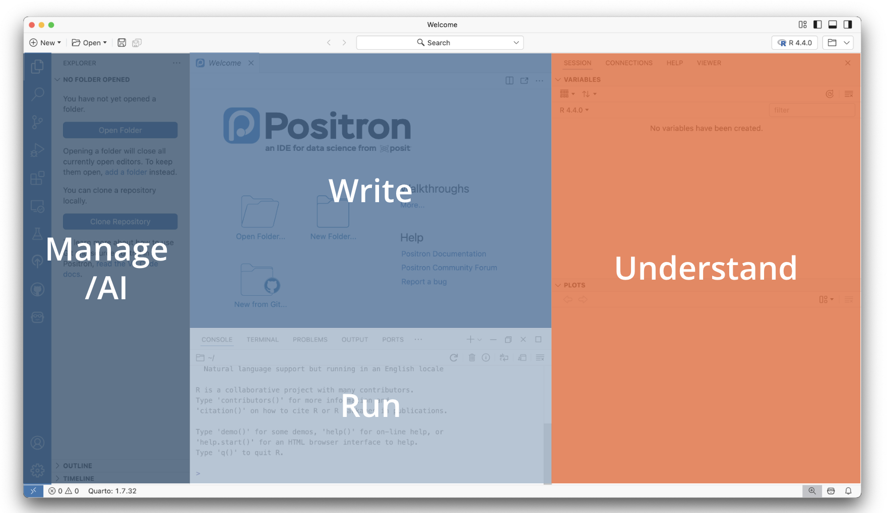
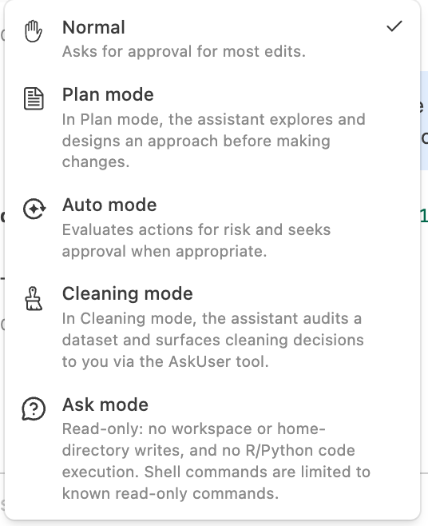
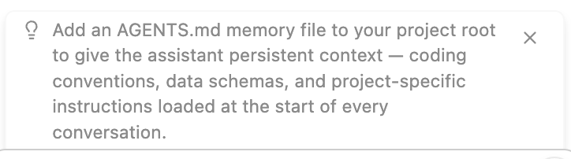

## Thank you {.center}

Special thanks to **Garrett Grolemund** (Director of Learning, Posit PBC) and **François Michonneau** (Solutions Engineer, Posit PBC) for the original materials this webinar is based on.

# Part 1: Hello, Posit Assistant!

## What is Posit Assistant?

A data analysis assistant that connects to your live R and Python sessions, sees your data, and helps you explore, visualize, build, and debug.

- Comes with data science skills with curated context for R, Python, and Posit tools
- Encourages a code-first method
- Operates in your R and Python sessions

## Uses your* preferred LLM providers

- Needs a model provider to power its responses

- **Posit AI Pass**, a managed service from Posit where you sign in once with no API keys to manage, is the easiest way to get started

- Also supports many other providers including Anthropic, OpenAI, Google Gemini, and local models like Ollama

::: aside
At least *many of* your preferred LLM providers
:::

## Reads your session {.smaller}

Connects to your live R and Python sessions and sees:

- **Loaded packages** — knows what's available without being told
- **Data frames in memory** — understands your data's structure
- **Console history** — picks up where you left off

Generated code works with your actual environment, not a generic example.

::: {.callout-tip appearance="simple"}
You can toggle session context on or off with the **eye icon** in the status bar — useful when you want a generic answer uninfluenced by your current environment.
:::

## Works where you work

Posit Assistant runs across multiple environments:

| Platform | Notes |
|----------|-------|
| **Positron** | Pre-installed in recent versions |
| **RStudio** | Latest release; includes Next-Edit Suggestions |
| **Terminal** | `pa` TUI for interactive or headless use |

## This webinar:<br>Posit Assistant in Positron {.center}

While Posit Assistant works in RStudio and the terminal too, this webinar introduces it through **Positron**.

# Part 2: Hello, Positron!

## What is Positron?
 
::: {.columns}

::: {.column width="30%"}

A free fork of Visual Studio Code purpose-built for **data science**

:::

::: {.column width="70%"}



:::

:::

::: {.callout-tip appearance="simple"}
Get it at [positron.posit.co](https://positron.posit.co)
:::

## Projects = folders

Quickly set up directories and virtual environments with **New Folder from Template**

- Start an R or Python project from scratch
- Templates include virtual environment setup
- Git integration built in

## New folder from Git

Clone a repository directly into Positron:

**New → New Folder from Git**

::: {.demo}
🖥️ **Demo:** 

Clone a repo ([github.com/mine-cetinkaya-rundel/think-first-pa-webinar-asa](https://github.com/mine-cetinkaya-rundel/think-first-pa-webinar-asa)) and take a tour of Positron. 
:::

## Positron at a glance {.center}

{fig-alt="Positron IDE with areas marked for manage/AI, write, run, understand."}

## Command palette

Searchable list of **all commands** in Positron -- Type any command name to filter and run it instantly — no need to navigate menus.

**Keyboard shortcut:** `Cmd/Ctrl + Shift + P`

::: {.demo}
🖥️ **Demo:**

1. Open the Command Palette with `Cmd/Ctrl + Shift + P`
2. Find and run the command **Developer: Reload Window**
:::

## Posit Assistant in Positron

Posit Assistant is Positron's default AI experience (replacing Positron Assistant and Databot -- see [history of Posit data science agents](https://opensource.posit.co/blog/2026-06-11_history-of-posit-data-science-agents/).

::: {.demo}
🖥️ **Demo:** 

Open Posit Assistant, then ask

> *Load the data in `credit_raw.csv`. What is the lowest age in the data set? The highest?*
:::

# Part 3: Diving deeper with Posit Assistant

## The WEAR philosophy

::: {.callout-important appearance="simple"}
**Code is the most auditable way to explore data with AI.**
:::

- **W**rites R or Python code
- Has your computer **E**xecute it
- **A**nalyzes the results
- **R**ecaps with suggestions

## Modes: Built-in behavior for different tasks

::: {.columns}

::: {.column}

Posit Assistant has **specialized modes** that adapt its behavior.

:::

::: {.column}

{alt="Posit Assistant modes: Normal, Plan mode, Auto mode, Cleaning mode, Ask mode."}

:::

:::

## Normal mode

The default mode for everyday work:

- Write, edit, and debug R and Python code
- Answer questions about your data or code
- Build functions, scripts, apps, and reports

No special restrictions — the assistant reads and writes freely, executing code and making changes as needed.

## Auto mode

- The assistant takes the wheel autonomously, deciding what tools to use and when

- Useful for multi-step tasks where you want it to explore, iterate, and apply changes with minimal back-and-forth — without needing to approve each action

## Plan mode

- Collaborate on a design before any code changes are made

- Enter with `/plan` -- can
  - explore your project with read-only tools
  - ask clarifying questions about your requirements
  - write a step-by-step plan file for your approval

- Once you approve, it begins implementing immediately

## Cleaning mode

Purpose-built for data auditing and tidying: checks column names, types, distinct values, outliers, and potential data-entry errors — surfacing every substantive cleaning decision for  approval before acting.

## Ask mode

- A read-only mode for exploring and understanding without any side effects

- Enter with `/ask` -- can read files, search code, and inspect your R/Python session — but cannot modify files, execute code, or use MCP tools

- Exit with `/normal`

## Cleaning data

::: {.demo}
🖥️ **Demo:** 

Open Posit Assistant, choose Cleaning mode, and ask it:

> Clean the data in `credit_raw.csv`. Save the clean version of the data as `credit.csv`.
:::

## Prompt advice

For each prompt, explain:

::: medium

| Element | Purpose | Example |
|---------|---------|---------|
| **Why** | Your ultimate goal | *"I want to understand loan risk…"* |
| **What** | Clear instructions | *"Fit a logistic regression…"* |
| **How** | Tools to use | *"…using the `tidymodels` package"* |

:::

::: {.callout-tip appearance="simple"}
Good prompts → "better", more targeted code.
:::

## Analyzing data

::: {.demo}
🖥️ **Demo:** 

Ask Posit Assistant:

> *I'm trying to understand the factors associated with loan delinquencies. Please load `credit.csv`. Then fit a simple logistic regression to the data that uses `serious_dlqin_2yrs` as a response variable. Use the `tidymodels` (R) / `statsmodels` (Python) package.*

Follow up until you understand what the model says.
:::

## Memory: AGENTS.md

Posit Assistant can remember context across sessions via **AGENTS.md** files:

- **User-level** (`~/.posit/assistant/AGENTS.md`) — personal preferences
- **Project-level** (`AGENTS.md` in repo root) — project facts, data schemas, conventions

::: {.callout-tip appearance="simple"}
Full docs: [assistant.posit.co/docs/features/memory](https://assistant.posit.co/docs/features/memory/)
:::

## Skills

Skills are **specialized modules of instructions** that Posit Assistant loads automatically when relevant — or you can invoke them directly with `/skill-name`.

## Built-in skills

::: {.small}

| Skill | Description |
|---|---|
| `create-skill` | Create new Agent Skills following the specification |
| `import-instructions` | Migrate Positron, Copilot, Claude Code, and VS Code instruction files into Posit Assistant skills |
| `posit-products` | Use Positron IDE and Posit Workbench; deploy to Posit Connect and Posit Connect Cloud |
| `predictive-modeling-python` | Modeling and machine learning with scikit-learn in Python |
| `predictive-modeling-r` | Modeling and machine learning with tidymodels in R |
| `quarto-authoring` | Write and author Quarto documents (.qmd) |
| `report` | Create Quarto documents or notebooks from conversations |
| `r-package-development` | R package development with devtools, testthat, and roxygen2 |
| `shiny-bslib` | Build modern Shiny dashboards and apps with bslib |
| `shiny-bslib-theming` | Advanced theming for Shiny apps using bslib and Bootstrap 5 |
| `snowflake` | Connect to Snowflake and query data via semantic views |

: {tbl-colwidths="[35,65]"}

:::

## Custom skills

- Add your own skills at the user or project levels

- Each skill is a folder with a `SKILL.md` file:

```markdown
---
name: my-skill
description: When to use this skill.
---
# My Skill
Instructions for the assistant to follow when this skill is active.
```

::: {.callout-tip appearance="simple"}
Docs: [assistant.posit.co/docs/features/skills](https://assistant.posit.co/docs/features/skills/)
:::

## Explore model results

::: {.demo}

🖥️ **Demo:** 

Begin exploring the model with visuals or tables. Pick one prompt and iterate:

- *Draw an ROC curve for the model.*
- *Use `gt` (R) or `great_tables` (Python) to make a table listing the odds ratio for each predictor.*
- *Use `ggplot2` (R) or `plotnine` (Python) to make a calibration plot for the model.*

:::

## Slash commands {.smaller}

Posit Assistant responds to `/` commands for common tasks:

::: {.medium}

| Command | What it does |
|---------|-------------|
| `/report` | Create a Quarto document from the conversation |
| `/notebook` | Export the conversation as a Jupyter notebook |
| `/savememory` | Create or update the project memory file (`AGENTS.md`) |
| `/plan` | Enter Plan mode — design an approach before writing code |
| `/ask` | Enter Ask mode — read-only exploration, no changes made |
| `/compact` | Summarize the conversation to reduce token usage |
| `/microcompact` | Replace tool results with placeholders to reduce token usage |
| `/context` | Show session context and token usage for the current conversation |
| `/new` | Start a new conversation |
| `/clear` | Start a new conversation, keeping current model settings |

: {tbl-colwidths="[20,80]"}

:::

Skills also appear in the `/` menu — type `/skill-name` to invoke any skill directly.

## Saving your work

::: {.demo}

🖥️ **Demo:** 

Run `/report` or `/notebook` in Posit Assistant to save your code. Then:

- **Quarto**: Click **Preview** at the top of the file
- **Notebook**: Click **Run All Cells**

:::

## Translating code between languages

Excellent at translating between R and Python!


::: {.demo}
🖥️ **Demo:** 

> *I'd like to experiment with this model fit. Turn `test.R` (or `test.py`) into a Shiny app that lets the user adjust parameters for creating the simulated dataset and then shows the results of fitting the model to the data. Include an action button so the model does not update until the user is finished describing the data.*

:::

# Part 4: Next steps

## Tips and suggestions

As you work, Posit Assistant proactively surfaces **tips and suggestions** — things like improving your workflow, setting up memory, or using a relevant feature you might not know about.

{fig-alt="Posit Assistant tip suggesting to add an AGENTS.md memory file to the project root for persistent context."}

## Next Edit Suggestions

- A separate AI feature — not Posit Assistant — built into Positron and RStudio

- As you edit code, it predicts and proposes your next change inline, right in the editor -- tab to accept

::: {.callout-note appearance="simple"}
Next Edit Suggestions requires a model provider configured in Positron, but operates independently of the Posit Assistant chat panel.
:::

## Posit AI Pass

The easiest way to get started — a **managed LLM service from Posit**:

- Sign in **once** with your Posit account — no API keys to manage
- Access to a curated set of models
- Designed to work seamlessly with Posit Assistant

::: {.callout-tip appearance="simple"}
Get started at [posit.ai](https://posit.ai/)!
:::

## Thank you! {.center background-color="#2E4057" footer=false}

::: {.large}
Questions?
:::

::: {.center}
🔗 Posit Assistant: [assistant.posit.co](https://assistant.posit.co)

[in Positron](https://assistant.posit.co/docs/downloads/positron/) · [in RStudio](https://assistant.posit.co/docs/downloads/rstudio/) · [in Terminal](https://assistant.posit.co/docs/downloads/tui/)

🔗 Slides: [bit.ly/think-first-pa](https://bit.ly/think-first-pa)
:::
